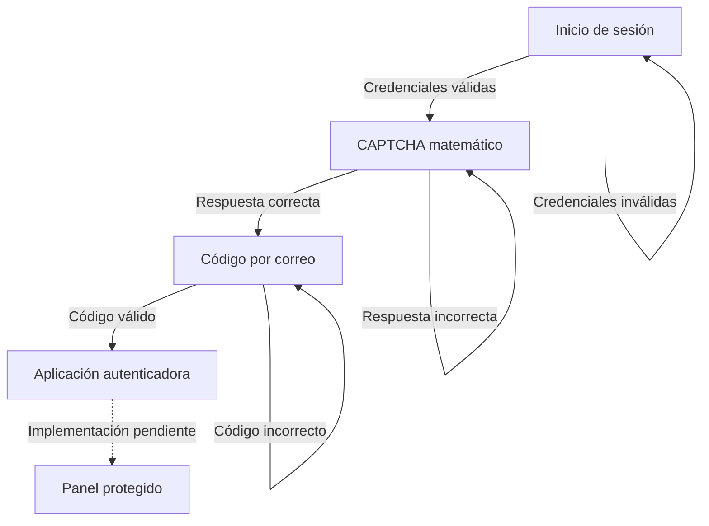

# Práctica de seguridad

Aplicación web desarrollada con Flask para demostrar un flujo simple de autenticación por capas. El diseño contempla cuatro verificaciones consecutivas antes de acceder al panel protegido. Las primeras tres están implementadas y la cuarta se encuentra pendiente.

## Capas implementadas

| Capa | Verificación | Controles principales |
| --- | --- | --- |
| 1 | Usuario y contraseña | Hash de contraseña, mensajes genéricos y sesión limitada |
| 2 | CAPTCHA matemático | Generación en el servidor, expiración y reemplazo del desafío |
| 3 | Código enviado por correo | Código de seis dígitos, HMAC, expiración, límite de intentos y control de reenvío |
| 4 | Aplicación autenticadora mediante QR | Pendiente de implementación |

## Flujo de acceso



La sesión registra el progreso mediante `security_layer`. Cada ruta protegida comprueba el nivel alcanzado y redirige al usuario a la verificación pendiente. En la versión actual, completar la tercera capa permite acceder al panel porque la cuarta todavía no forma parte del flujo ejecutable.

## Cuarta capa planificada

La cuarta capa utilizará contraseñas temporales de un solo uso basadas en tiempo, conocidas como TOTP. El usuario vinculará su cuenta con una aplicación compatible, como Google Authenticator u Oracle Mobile Authenticator, mediante un código QR.

El flujo previsto es:

1. Generar un secreto TOTP individual para el usuario.
2. Crear una URI de aprovisionamiento con formato `otpauth://`.
3. Convertir la URI en un código QR y mostrarlo durante el enrolamiento.
4. Escanear el QR desde la aplicación autenticadora.
5. Solicitar un código temporal para confirmar que la vinculación fue correcta.
6. Guardar el secreto y activar TOTP únicamente después de una confirmación válida.
7. Solicitar un código nuevo del autenticador durante los accesos posteriores.
8. Marcar `security_layer = 4` antes de permitir el acceso al panel.

El repositorio ya incluye dependencias para esta función:

- `PyOTP` para generar y verificar códigos TOTP.
- `qrcode` para crear el código QR.
- `Pillow` para producir la imagen del QR.

La tabla `users` también contiene los campos `totp_secret` y `totp_enabled`. Estos elementos preparan la siguiente etapa, pero todavía no existen rutas, formularios ni plantillas que implementen el enrolamiento o la verificación TOTP.

## Funciones actuales

- Creación de usuarios mediante un comando de Flask.
- Contraseñas transformadas con `generate_password_hash()` de Werkzeug.
- Formularios protegidos contra CSRF mediante Flask-WTF.
- Sesiones con duración máxima de 15 minutos.
- Cookies de sesión con `HttpOnly` y `SameSite=Lax`.
- Mensaje genérico ante credenciales incorrectas.
- CAPTCHA matemático con vigencia de cinco minutos.
- Código de correo de seis dígitos generado con `secrets`.
- Código almacenado como HMAC-SHA256 en lugar de texto plano.
- Cinco intentos como máximo por código.
- Espera de 60 segundos entre reenvíos.
- Invalidación del desafío anterior cuando se genera uno nuevo.
- Limpieza de los desafíos al completarlos o cerrar la sesión.
- Nombre visible del remitente configurable.

## Tecnologías

- Python
- Flask y Jinja
- Flask-WTF y WTForms
- Werkzeug
- SQLite
- SMTP con TLS
- python-dotenv
- PyOTP, qrcode y Pillow, reservadas para la cuarta capa

Las versiones utilizadas se encuentran fijadas en `requirements.txt`.

## Estructura del proyecto

```text
seguridad-practica/
├── app.py
├── requirements.txt
├── .gitignore
├── README.md
└── templates/
    ├── login.html
    ├── captcha.html
    ├── email_verification.html
    ├── dashboard.html
    └── error.html
```

Al ejecutar la aplicación se genera `seguridad.db`. El archivo `.env`, la base de datos y el entorno virtual están excluidos mediante `.gitignore`.

## Requisitos previos

- Python 3 instalado.
- Git, si se clonará el repositorio.
- Una cuenta de correo con acceso SMTP.
- Para Gmail, verificación en dos pasos y una contraseña de aplicación.

## Instalación

### 1. Clonar el repositorio

```bash
git clone https://github.com/VictorQ1/seguridad-practica.git
cd seguridad-practica
```

### 2. Crear un entorno virtual

Linux o macOS:

```bash
python3 -m venv venv
source venv/bin/activate
```

Windows PowerShell:

```powershell
py -m venv venv
.\venv\Scripts\Activate.ps1
```

### 3. Instalar las dependencias

```bash
python -m pip install -r requirements.txt
```

## Configuración

### 1. Crear la clave secreta

Crea un archivo llamado `.env` en la raíz del proyecto. Puedes generar una clave aleatoria con:

Linux, macOS o PowerShell:

```bash
python -c "import secrets; print('SECRET_KEY=' + secrets.token_hex(32))"
```

Copia el resultado en `.env`. No reutilices la clave de otra persona.

### 2. Configurar el servidor de correo

Para Gmail, el contenido de `.env` debe seguir esta estructura:

```env
SECRET_KEY=CLAVE_ALEATORIA_GENERADA

MAIL_SERVER=smtp.gmail.com
MAIL_PORT=587
MAIL_USE_TLS=true
MAIL_USERNAME=cuenta_remitente@gmail.com
MAIL_PASSWORD=CONTRASEÑA_DE_APLICACION
MAIL_FROM=cuenta_remitente@gmail.com
MAIL_SENDER_NAME=Sistema de Seguridad
```

Consideraciones:

- `MAIL_PASSWORD` debe ser una contraseña de aplicación de Google, no la contraseña normal de Gmail.
- `MAIL_FROM` es la dirección que aparecerá como remitente.
- `MAIL_SENDER_NAME` controla el nombre visible del remitente.
- El correo introducido al crear cada usuario será el destinatario de sus códigos.
- Cada integrante del equipo debe crear su propio `.env` local.

Comprueba que el archivo no será agregado a Git:

```bash
git check-ignore .env
```

El resultado debe ser `.env`.

## Crear un usuario

Con el entorno virtual activo, ejecuta:

```bash
flask --app app create-user admin
```

La terminal solicitará:

```text
Correo electrónico:
Contraseña:
Repite la contraseña:
```

La contraseña debe tener al menos ocho caracteres. Mientras se escribe no se muestran caracteres en la terminal.

### Cambiar el correo de un usuario existente

El correo del usuario se almacena en `seguridad.db`. Si tienes el cliente de SQLite instalado, puedes modificarlo así:

```bash
sqlite3 seguridad.db
```

```sql
UPDATE users
SET email = 'nuevo_correo@ejemplo.com'
WHERE username = 'admin';

.quit
```

`MAIL_FROM` cambia el remitente. El campo `users.email` cambia el destinatario.

## Ejecutar la aplicación

```bash
python app.py
```

Después abre:

```text
http://127.0.0.1:5000
```

## Flujo de uso

1. Introduce el usuario y la contraseña.
2. Resuelve la operación matemática.
3. Revisa el correo registrado para obtener el código de seis dígitos.
4. Introduce el código dentro de los cinco minutos siguientes.
5. En la versión actual, accede al panel protegido después de completar la tercera capa.
6. Utiliza el botón de cierre de sesión para terminar el acceso.

Cuando la cuarta capa esté implementada, el código enviado por correo conducirá a la verificación TOTP en lugar de abrir directamente el panel.

## Rutas principales

| Ruta | Método | Función |
| --- | --- | --- |
| `/` | `GET`, `POST` | Inicio de sesión |
| `/captcha` | `GET`, `POST` | Verificación del CAPTCHA |
| `/captcha/refresh` | `POST` | Generación de otra operación |
| `/email-verification` | `GET`, `POST` | Validación del código recibido |
| `/email-verification/resend` | `POST` | Solicitud de otro código |
| `/dashboard` | `GET` | Panel protegido |
| `/logout` | `POST` | Cierre de sesión |

## Base de datos

La aplicación crea automáticamente estas tablas:

| Tabla | Contenido |
| --- | --- |
| `users` | Usuario, hash de contraseña, correo, rol y campos preparados para TOTP |
| `captcha_challenges` | Pregunta, respuesta, propietario y expiración del CAPTCHA |
| `email_challenges` | HMAC del código, intentos, fecha de creación y expiración |

Para inspeccionar datos no sensibles durante el desarrollo:

```bash
sqlite3 seguridad.db
```

```sql
.tables
SELECT id, username, email, role FROM users;
.quit
```

No agregues `seguridad.db` al repositorio porque puede contener correos y hashes de usuarios.

## Pruebas manuales recomendadas

1. Probar credenciales incorrectas y confirmar que no se abre el CAPTCHA.
2. Probar credenciales correctas y confirmar la redirección a `/captcha`.
3. Responder incorrectamente y verificar que se genere otra operación.
4. Utilizar el botón para generar un CAPTCHA diferente.
5. Resolver el CAPTCHA y comprobar la recepción del correo.
6. Introducir códigos incorrectos y comprobar los intentos restantes.
7. Intentar reenviar el código antes de que transcurran 60 segundos.
8. Esperar más de cinco minutos y comprobar que el código expire.
9. Abrir `/dashboard` antes de completar todas las verificaciones.
10. Cerrar la sesión e intentar abrir una ruta protegida.

Las pruebas de enrolamiento, escaneo del QR, validación TOTP y recuperación de acceso se agregarán junto con la cuarta capa.

## Solución de problemas

### No se encontró `SECRET_KEY`

Comprueba que `.env` se encuentre junto a `app.py` y contenga una línea `SECRET_KEY=...` válida.

### El correo no llega

- Revisa la salida de Flask en la terminal.
- Verifica `MAIL_USERNAME`, `MAIL_FROM` y la contraseña de aplicación.
- Confirma que Gmail tenga habilitada la verificación en dos pasos.
- Revisa la carpeta de spam.
- Reinicia Flask después de modificar `.env`.

## Consideraciones de seguridad

- Nunca publiques `.env`, contraseñas de aplicación ni bases de datos locales.
- `debug=True` solo debe utilizarse durante el desarrollo local.
- El servidor integrado de Flask no debe exponerse directamente a Internet.
- Un despliegue real debe utilizar HTTPS y `SESSION_COOKIE_SECURE=True`.
- El CAPTCHA matemático es una demostración académica y no sustituye un sistema especializado contra automatización.
- La verificación por correo depende de la seguridad de la cuenta de correo del usuario.
- Antes de un uso real se requieren límites de solicitudes, registros de auditoría, migraciones y pruebas automatizadas.
- El secreto TOTP deberá protegerse en la base de datos y nunca mostrarse nuevamente después del enrolamiento.
- La cuarta capa deberá contemplar códigos de recuperación o un procedimiento controlado para dispositivos perdidos.

## Próximos pasos

- Implementar el enrolamiento TOTP y la generación del QR.
- Agregar una pantalla para confirmar el primer código del autenticador.
- Insertar la verificación TOTP entre el código por correo y el panel.
- Proteger el panel hasta que `security_layer` alcance el nivel 4.
- Definir un mecanismo de recuperación para la pérdida del dispositivo autenticador.
- Agregar pruebas automatizadas para las cuatro capas.

## Colaboración

Antes de comenzar cambios:

```bash
git pull
git switch -c feature/nombre-del-cambio
```

Después de probarlos:

```bash
git add .
git commit -m "Describe brevemente el cambio"
git push -u origin feature/nombre-del-cambio
```

Cada persona debe mantener sus credenciales únicamente en su archivo `.env` local.
